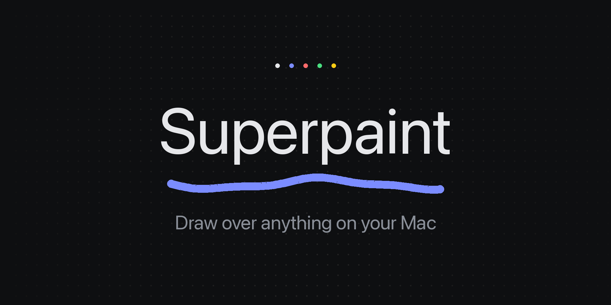

<div align="center">



**Draw over anything on your Mac.**

Press one hotkey and your whole desktop becomes a canvas — every app, every
screen. Made for explaining: sketch an algorithm over a LeetCode page while
sharing your screen, circle a bug in a code review, underline a line in a
PDF. Press the hotkey again and everything is back to normal.

<a href="https://github.com/faraz-35/superpaint/releases/latest"></a>


<a href="LICENSE"></a>
<a href="https://github.com/faraz-35/superpaint/releases/latest"></a>

[Website](https://getsuperpaint.vercel.app) · [Download for macOS](https://github.com/faraz-35/superpaint/releases/latest)

</div>

Native Swift + AppKit. One small binary. No dependencies, no network, no
analytics.

## Use

- **⌘⌥P** — turn the desktop into a canvas (all screens at once). Press again to hide.
- **esc** — hide and give clicks back to your apps.
- Draw with the mouse. Your ink is kept while hidden until you clear it.

While the canvas is up, clicks and keys go to it — that's canvas mode. Press
**b** (or **⌘⌥B**, or the hand button) for browse mode: the ink stays on
screen, but scrolling and clicks pass through to your apps. Scroll the page,
click a link, then press **b** again to keep drawing. Picking any tool also
returns you to drawing.

## Tools

The toolbar sits at the bottom of whichever screen your mouse is on.

| key | tool |
|-----|------|
| `v` | select — drag a box around ink; drag inside the box to move it; **⌘C** copies, **⌘V** pastes, **⌫** deletes |
| `p` | pen |
| `h` | highlighter |
| `l` | line — hold **shift** to snap to 45° steps |
| `a` | arrow — hold **shift** to snap |
| `r` | rectangle — hold **shift** for a square |
| `o` | ellipse — hold **shift** for a circle |
| `t` | text — click where it should go, type, **enter** to keep it (**esc** discards) |
| `e` | eraser — click or drag across any ink |
| `b` | browse — clicks and scrolling pass through to apps; press again to draw |
| `c` | cycle through 5 inks |
| `1` `2` `3` | thin / medium / thick |
| **⌘Z** / **⇧⌘Z** | undo / redo |

Pen + **shift** doubles as a ruler: a straight line from where the stroke
started.

With select, everything the box touches gets a dashed outline. A plain click
picks the one item under it; **esc** drops the selection (press again to hide
the canvas). Pasted ink appears a nudge away from the original and stays
selected, so you can drag it straight to where you want it. Copy on one
screen, paste on another works too — the copy centers itself if the new
screen is smaller. Move, paste and delete are all one undo step each.

A pencil sits in the menu bar with the same three actions: toggle, clear this
screen, quit.

## Build & run

Needs Xcode command line tools (`xcode-select --install`). Nothing else.

```sh
./build.sh
open Superpaint.app
```

## How it works

One transparent `NSPanel` per screen, always on top and present on every
workspace. Panels are non-activating, so annotating never steals focus from
the app underneath. Toggling flips `ignoresMouseEvents` and orders the panels
out; the ink model survives, keyed by display, so replugging a monitor keeps
your drawing.

Because the overlay window is an `NSPanel`, tiling window managers that
manage standard windows (AeroSpace, yabai's managed set) never grab or park
it — the same trick SketchyBar uses.

Text input is captured straight from key events and rendered with the same
code as committed text, so there is no editing control and no editing chrome
anywhere in the stack.

## Privacy

Superpaint talks to nothing. No analytics, no telemetry, no updates over the
network. It has no network code at all.

## License

[MIT](LICENSE)
